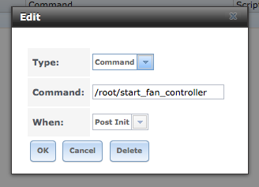

# hybrid_fan_control
dual zone CPU and HD fan control for SuperMicro X10/X11 TrueNAS systems

I first wrote this script in 2016-09-15. And published it on the TrueNAS (then FreeNAS) forums at:
https://www.truenas.com/community/threads/script-hybrid-cpu-hd-fan-zone-controller.46159/

Kevin Horton has extended the original script for PID control:
https://www.truenas.com/community/threads/pid-fan-controller-perl-script.50908
https://github.com/khorton/nas_fan_control

And Sretella then ported the script to a Corsair fan controller:
https://github.com/sretalla/nas_fan_control

I have since updated the script for use on SCALE, as well as CORE.

These days I launch the script with the following pre-init [command](https://www.truenas.com/community/threads/script-hybrid-cpu-hd-fan-zone-controller.46159/post-649030)

`tmux new-session -d -s fanscript '/mnt/tank/server/scripts/hybrid_fan_controller.pl'`

Below follows the original post:

---

So, I've been working on something.

```
# This script is designed to control both the CPU and HD fans in a Supermicro X10 based system according to both
# the CPU and HD temperatures in order to minimize noise while providing sufficient cooling to deal with scrubs
# and CPU torture tests.

# It relies on you having two fan zones.
```

Its a script that controls both the CPU and HD zones with a Dual Zone Supermicro IPMI board.

It was inspired by Kevin's script and research

The CPU and HD zones can be fully independant, or they can be shared. If they are shared, then when the CPU needs cooling, the HD fans will spin up with the CPU fans, otherwise the HD fans will only spin up when the HDs need cooling.

The complexity is that it will adjust the CPU fans on a per second basis, and the HD fans (when not overridden) every 3 minutes. It will verify a change in fan speed after each setting, as well as handles crashed high and crashed low BMC scenarios, including waiting for the BMC readings to stabilize and come good, including handling the scenario when they don't.

The script is designed to fail high. Ie if it should go off the rails, which I don't think it does, then it fails high.

So why did I do this? Because I've built a very powerful FreeNAS box which will be used for VMs and transcoding etc, but is in an office environment, and will otherwise be idle for most of its life. I wanted to minimize fan noise as much as possible, without affecting peak performance or component life-time, and I am pretty happy with the results :)

```
# To use this correctly, you should connect all your PWM HD fans, by splitters if necessary to the FANA header.
# CPU, case and exhaust fans should then be connected to the numbered (ie CPU based) headers.  This script will then control the
# HD fans in response to the HD temp, and the other fans in response to CPU temperature. When CPU temperature is high the HD fans.
# will be used to provide additional cooling, if you specify cpu/hd shared cooling.
```

also

```
# NOTE: It is highly likely the "get_hd_temp" function will not work as-is with your HDs. Until a better solution is provided
# you will need to modify this function to properly acquire the temperature. Setting debug=2 will help.
```

Here is an example of its logged output, while I spawned/killed mprime a few times:
```
cat ./fan_control.log
2016-09-19 01:29:11: CPU Temp: 33 <= 35, CPU Fan going low.
2016-09-19 01:29:12: Maximum HD Temperature: 30
2016-09-19 01:29:12: Drives are cool enough, going to 30%
2016-09-19 01:30:25: CPU Temp: 52 >= 50, CPU Fan going high.
2016-09-19 01:30:25: Overiding HD fan zone to 100%
2016-09-19 01:30:34: CPU Temp: 40 >= 40, CPU Fan going med.
2016-09-19 01:30:34: Restoring HD fan zone to 30%
2016-09-19 01:30:40: CPU Temp: 50 >= 50, CPU Fan going high.
2016-09-19 01:30:40: Overiding HD fan zone to 100%
2016-09-19 01:30:42: CPU Temp: 38 dropped below 40, CPU Fan going med.
2016-09-19 01:30:42: Restoring HD fan zone to 30%
2016-09-19 01:30:46: CPU Temp: 54 >= 50, CPU Fan going high.
2016-09-19 01:30:46: Overiding HD fan zone to 100%
2016-09-19 01:30:51: CPU Temp: 37 dropped below 40, CPU Fan going med.
2016-09-19 01:30:51: Restoring HD fan zone to 30%
2016-09-19 01:30:55: CPU Temp: 52 >= 50, CPU Fan going high.
2016-09-19 01:30:55: Overiding HD fan zone to 100%
2016-09-19 01:31:06: CPU Temp: 42 >= 40, CPU Fan going med.
2016-09-19 01:31:06: Restoring HD fan zone to 30%
2016-09-19 01:31:30: CPU Temp: 35 <= 35, CPU Fan going low.
2016-09-19 01:32:13: Maximum HD Temperature: 30
2016-09-19 01:35:15: Maximum HD Temperature: 31
2016-09-19 01:38:16: Maximum HD Temperature: 31
2016-09-19 01:41:17: Maximum HD Temperature: 32
2016-09-19 01:44:18: Maximum HD Temperature: 32
```

Most everything is configurable, and the vebosity ($debug) scales well.

When testing, I just launch it in with screen

`screen ./hybrid_fan_controller.pl`

But, when using it for real, as I am now, I made a simple "start_fan_controller" script

```
#!/bin/bash
echo "Starting Hybrid Fan Controller..."
/root/hybrid_fan_controller.pl &>> /root/fan_control.log &
```

which I just launched as a post-init command in freeNAS gui.



Maybe this is not the best way to launch this script, but it seems to work for me.

Let me know what you think :)

WARNING: shutdown the script before performing any IPMI firmware updates, or [else](https://www.truenas.com/community/threads/script-hybrid-cpu-hd-fan-zone-controller.46159/post-452449).
