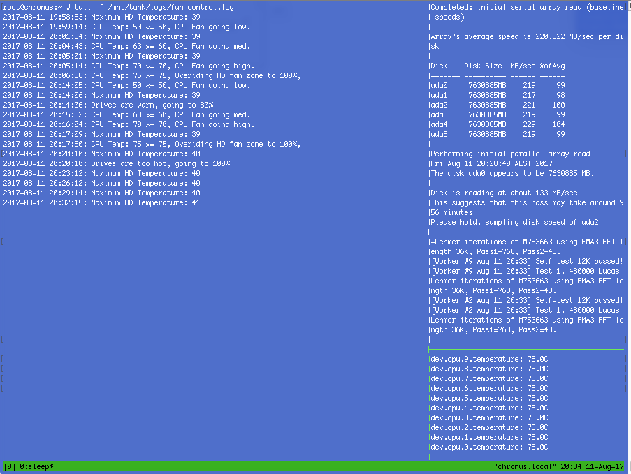

These scripts can come in handy when thermal testing the hybrid_fan_controller script in order to establish
what configurations are desirable.

This is an example of their usage ([original post](https://www.truenas.com/community/threads/script-hybrid-cpu-hd-fan-zone-controller.46159/post-399671))

---

I've been [building](https://www.truenas.com/community/threads/build-report-node-304-x10sdv-tln4f-esxi-freenas-aio.57116/) a new ESXi/FreeNAS AIO box, based on a Xeon D 1541 X10SDV-TLN4F in a Fractal Node 304, with six 7200rpm drives.

I've finished all the commissioning, except for tuning the fan control script.

I've now finished tuning the parameters to what I regard as optimal noise/temperature control and am running an extended heat soak torture test. The basic goal is to ensure that the box can run without overheating in a worst case scenario.

The script is running at boot already, and is reading CPU temps and controlling fan speeds via remote IPMI rather than local IPMI.

